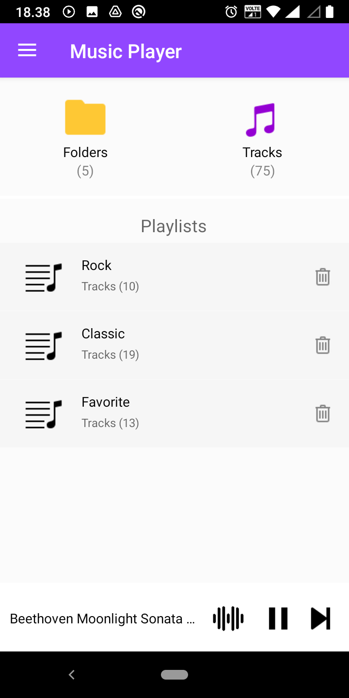
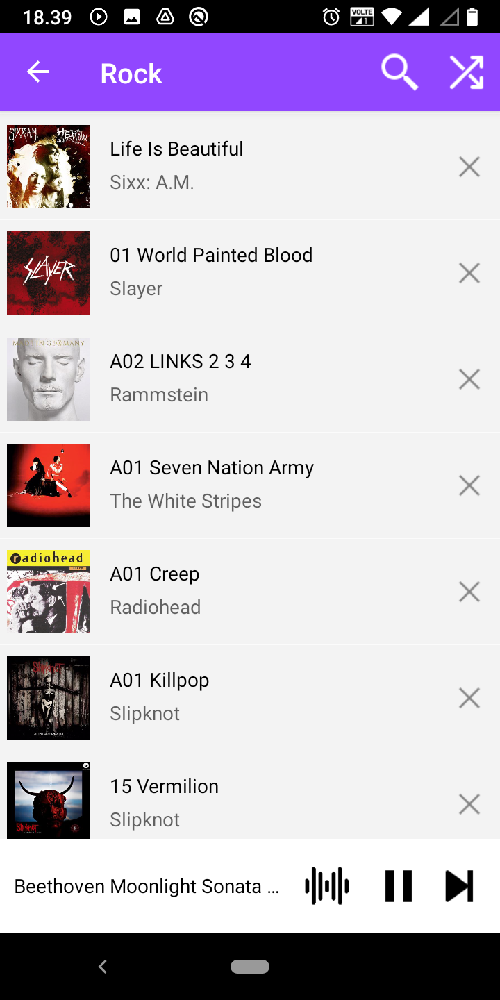
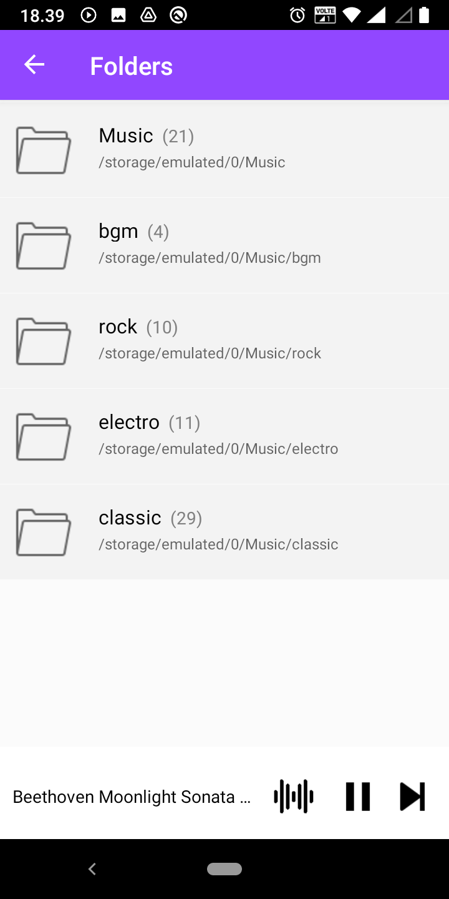
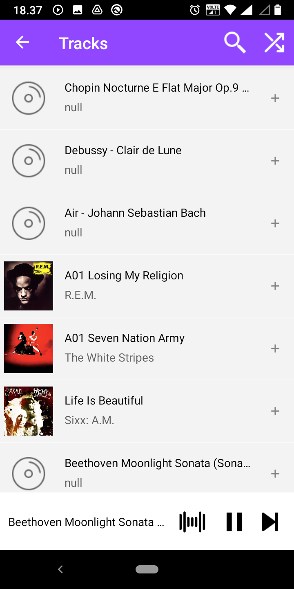

# Simple Music Player
Music player for Android

### Features
* Display music on the device by folders and songs.
* Create custom playlists: play, add and delete songs.
* Locates music files on the device Music folder.

### Screenshots
<!---->
    
